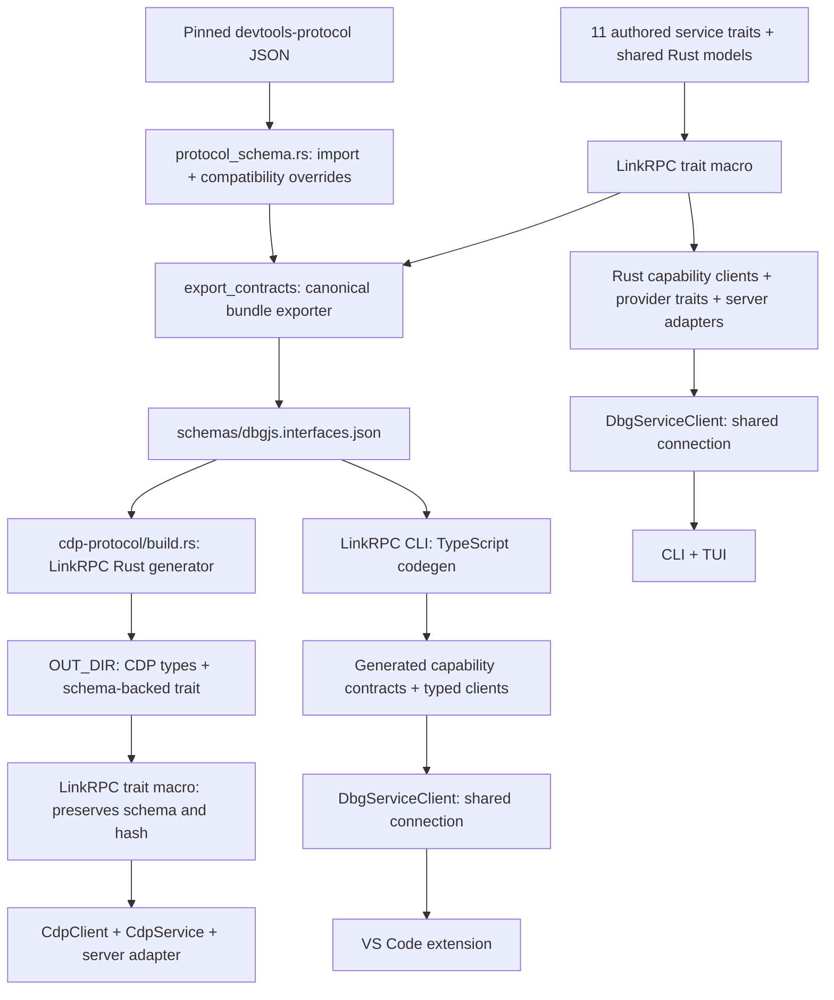

# RPC contracts and code generation

## Sources of truth

There are two authored protocol inputs, combined into one checked-in contract
bundle. Do not maintain separate Rust and TypeScript descriptions of a wire
interface.

| Contract | Authored source of truth | Derived consumer input |
| --- | --- | --- |
| Chrome DevTools Protocol | The `devtools-protocol` version pinned in the root npm lockfile, plus explicit compatibility overrides in [`protocol_schema.rs`](../crates/cdp-protocol/src/protocol_schema.rs) | The `cdp.protocol` interface in [`schemas/dbgjs.interfaces.json`](../schemas/dbgjs.interfaces.json) |
| CLI, daemon, and extension RPC | The annotated Rust traits in [`service_api/`](../src/service_api/) and shared serializable models in [`service_api.rs`](../src/service_api.rs) | Eleven capability interfaces in the same bundle |

The bundle is the canonical input for consumers and generators, not an
independently authored schema. Its interface list includes application-owned
contracts; framework discovery interfaces remain LinkRPC's responsibility.
Advertising the daemon service does not advertise a CDP service on the daemon's
authenticated local transport.

## Generated consumers



The Rust daemon clients and servers are generated directly from the annotated
Rust traits by LinkRPC's macro. The CLI uses those generated clients, rather than
constructing RPC method names or request objects independently.

[`scripts/generate-contracts.mjs`](../scripts/generate-contracts.mjs) orchestrates
the exporter and TypeScript CLI; it does not implement a code generator.
The legacy `cdp_codegen` binary includes the exporter implementation, so
`npm run prototype:schema` and `cargo run --bin export_contracts` share the
same export path. The root [`build.rs`](../build.rs) only embeds Git build
provenance; it does not generate RPC contracts.

The CDP crate's build reads the checked-in bundle. It does not re-import npm
protocol JSON during an ordinary build. Generated Rust is placed in Cargo's
`OUT_DIR`; do not edit that output. CDP providers implement supported methods of
the generated trait. Unsupported commands retain an explicit method-not-found
response, rather than fabricated successful results.

The extension's capability modules in
[`src/generated/`](../vscode-extension/src/generated/)
are produced by the **LinkRPC CLI**, preserving the exported wire schema and
interface identity. The extension uses its generated client and derives any
convenience aliases from generated types. Presentation models and endpoint-file
parsing are separate concerns; they must not become duplicate RPC schemas.

## Service interfaces and consumer ergonomics

Each operation has exactly one owning interface. The traits live in separate
modules, with matching implementation modules in
[`debugger_service/`](../src/debugger_service/). All implementations use the same
`DebuggerService` instance and state; this is not a split into independent
processes or databases.

| Facade field | Trait | Responsibility |
| --- | --- | --- |
| `service` | `ServiceApi` | Identity, process discovery/projection, shutdown |
| `contexts` | `ContextApi` | Contexts, connections, resource graph, observation, breakpoints |
| `sources` | `SourceApi` | Formatting, source discovery, search, mapping, export |
| `captures` | `CaptureApi` | Stored capture lifecycle and stored-result access |
| `targets` | `TargetDebuggerApi` | Resolution, attachment, execution, evaluation, values, logs/logpoints |
| `cdp` | `CdpAccessApi` | Raw CDP requests |
| `relay` | `RelayApi` | CDP relay and Playwright proxy lifecycle |
| `browser` | `BrowserAutomationApi` | Click, type, screenshot |
| `coverage` | `CoverageApi` | Live coverage lifecycle |
| `cpu` | `CpuProfilerApi` | CPU profiling |
| `heap` | `HeapProfilerApi` | Heap capture, streaming progress, selection, graph queries, comparison |

The Rust [`DbgServiceClient`](../src/service_api/client.rs) composes all eleven
generated clients over one connection:

```rust,ignore
let client = dbgjs::local_rpc::connect_existing(&state_file).await?;
let contexts = client.contexts.list_contexts(None).await?;
let sources = client.sources.list_sources(contexts[0].id.clone(), None).await?;
```

The TypeScript [`DbgServiceClient`](../vscode-extension/src/dbgServiceClient.ts)
provides the same facets:

```ts
const client = new DbgServiceClient(connection);
const contexts = await client.contexts.list_contexts({ cwd: null });
const sources = await client.sources.list_sources({
    contextId: contexts[0].id,
    path: null,
});
```

Consumers that need only one capability can use its generated client directly,
for example `ContextApiClient`; providers can implement only `ContextApi` and
register its generated server adapter. The bundle catalog drives the composite
Rust facade, interface export, and daemon registration from one list.

Every interface is registered on the same authenticated connection and advertised
through LinkRPC reflection. Connecting Rust clients validate every required
interface hash, not just the lifecycle interface. The lifecycle facet retains
the original `dev.dbgjs.cdp-debugger` ID and the existing `service_info` and
`shutdown` wire methods, so the CLI can identify and stop an incompatible old
daemon before starting the new one. Its hash changes because the other methods
have moved to their capability interfaces. The default interface is lifecycle
only; clients must use the appropriate capability for other operations.

## Bare CDP interfaces versus daemon capabilities

Multiple interfaces and bare wire addressing are separate concerns. The installed
Rust LinkRPC 0.2.1 supports registering multiple interfaces and binding distinct
bare prefixes with `bind_bare`, for example `DOM.` and `Runtime.`. Normal qualified
interface addressing remains available alongside those bindings. The daemon uses
qualified addressing for its capability interfaces; no new bare bindings are
needed for this split.

[Upstream's CDP contract fixture](https://github.com/hediet/linkrpc/blob/f585cd07c3c4968f6e52dec95096c86cf74350e1/typescript/packages/linkrpc-infra/test/protocols/contracts/cdp.ts)
imports one interface per CDP domain, with local member names such as `evaluate`
and a separate `Runtime.` binding. Its
[bare-binding tests](https://github.com/hediet/linkrpc/blob/f585cd07c3c4968f6e52dec95096c86cf74350e1/rust/crates/linkrpc/tests/bare_bindings.rs)
exercise several prefixes on the same connection. That domain importer is a
test fixture, not a public CDP-import CLI command.

This repository has adopted the supporting LinkRPC dependency, but its own CDP
importer still exports one `cdp.protocol` interface containing fully qualified
members such as `Runtime.evaluate`. Its root-addressed `CdpClient` and session
multiplexer are unchanged by the daemon interface split.

The upstream checkout's newer registration API configures `bare_prefix` in
`RegisterOptions` atomically instead of calling `bind_bare` separately. Use the
API of the installed published crate, not an assumption based on the sibling
checkout's version string.

## Regeneration and drift checks

From the repository root:

```sh
npm run generate:contracts
npm run check:contracts
```

Generation exports the CDP and service contracts into the bundle, then invokes
`linkrpc codegen` to generate TypeScript. The check command recomputes the
contracts and compares the generated output without overwriting stale files.
Commit the bundle and generated TypeScript together with their source changes.

The TypeScript generation step is the installed CLI, not a second generator
inside dbgjs. The orchestrator runs it once per advertised capability:

```sh
npx --no-install linkrpc codegen \
  --input schemas/dbgjs.interfaces.json \
  --interface dev.dbgjs.context \
  --name ContextApi \
  --output vscode-extension/src/generated/contextApi.ts \
  --preserve-wire-schema
```

Append `--check` to check that module without writing it. Use the root
`check:contracts` command to check both the source bundle and generated module.
The CLI generates one standalone module at a time; shared component schemas may
appear in several generated modules. They still come from the same authored Rust
models, rather than separately maintained TypeScript definitions.

When changing daemon RPC, edit the owning Rust trait/shared models first. When changing CDP
support, update the pinned upstream protocol or an explicit compatibility
override first. Regenerate, then compile and test the consumers; do not repair a
type error by manually editing generated files or weakening a wire type.

The checked-in bundle bootstraps the Rust exporter itself. This is why it is
versioned even though the authored inputs above remain authoritative.

## Registry dependencies and local LinkRPC development

Ordinary installs and CI resolve LinkRPC from the public npm and Cargo
registries. The checked-in manifests and lockfiles must contain only registry
dependencies; CI does not check out a sibling repository, use relative
`file:`/`path` links, or vendor LinkRPC sources. Required LinkRPC releases must
be published before their versions are selected in this repository.

The Rust dependencies require LinkRPC 0.2.1 or newer for schema-preserving,
macro-backed CDP bindings, typed heap-progress streams, and shared trait schemas.
The Rust generator emits a trait annotated with
`#[link_rpc_interface(schema_json = "...")]`; the same macro used by the daemon
trait generates the CDP client and provider infrastructure. The imported CDP
schema and hash are preserved rather than re-derived from generated Rust types.
The published TypeScript runtime and CLI
dependencies are pinned to 0.0.2.
Rust trait models use the same schemars 0.8 version as LinkRPC's shared-schema
collector; schemars 1 derives implement a different `JsonSchema` trait.

For opt-in development across both repositories, a developer may use a local
sibling checkout by temporarily overriding the relevant npm and Cargo
dependencies in their working tree. Build any required LinkRPC package outputs
in that checkout before installing this repository. Keep those local manifest
overrides and any resulting lockfile changes uncommitted and out of staging,
then restore the registry manifests and lockfiles before running the ordinary
install and contract drift check. Never commit local `file:`/`path` links or
copy package sources or tarballs into this repository.

For the isolated sibling development layout, an **uncommitted**
`.cargo/config.toml` can contain:

```toml
[patch.crates-io]
linkrpc = { path = "../linkrpc/rust/crates/linkrpc" }
linkrpc-macros = { path = "../linkrpc/rust/crates/linkrpc-macros" }
linkrpc-tokio = { path = "../linkrpc/rust/crates/linkrpc-tokio" }
```

Resolve the local patch once without `--locked`, then run the locked build,
generation, and tests. Remove this config and restore the registry lockfile
before committing. Ordinary builds, contract generation, and CI use only the
published registry dependencies.

## Typed heap-progress streams

`capture_heap_snapshot` and `take_heap_snapshot` declare
`#[output_stream(HeapSnapshotProgress)]` on the Rust trait. The annotation
describes the method's output: it exports `serverStream`, generates a
provider-side `StreamSender<HeapSnapshotProgress>`, and gives Rust and TypeScript
clients typed progress on the capture call alongside its final result.
The CLI consumes this stream rather than issuing 100 ms snapshot polls.

Progress comes from the existing CDP capture watch and is scoped to the actual
capture operation. The final progress update precedes the RPC response; the
underlying CDP snapshot chunks still finish writing before success is reported.
`get_heap_snapshot_progress` remains an independent last-known snapshot query,
not the transport for capture progress.

Cancellation is advisory: CDP has no interoperable heap-capture cancellation
command. A cancelled or disconnected LinkRPC caller must not interrupt raw CDP
chunk ingestion or leave a writer or capture reservation behind. The active CDP
operation is drained safely; the cancelled LinkRPC call reports cancellation.
Cancelled named captures are cleaned up before their reservation is released.
Subsequent captures can then run with their own progress. Cancellation is not
transaction rollback: `take_heap_snapshot` can have already atomically replaced
the requested destination file, which is retained after cancellation.

The generated TypeScript integration test starts the real Rust daemon and a
Node inspector, exercises completion/cancellation/disconnect/recovery, and runs
both CLI heap capture and snapshot commands:

```sh
cargo build --locked --bin dbgjs --bin dbgjs-service
npm --prefix vscode-extension ci
npm --prefix vscode-extension run test:heap-streaming
npm run check:contracts
```

## Type-safety boundaries

Known RPC methods, parameters, results, and notifications come from the shared
contracts. Raw CDP proxying, arbitrary evaluated JavaScript values, and
protocol-defined open JSON payloads remain explicit dynamic boundaries. Such
payloads are not evidence that another handwritten wire schema is needed.

Heap snapshot ordering, raw-event forwarding, older protocol compatibility, and
daemon authentication remain runtime behavior and are covered by their tests;
generation must not silently change them.
