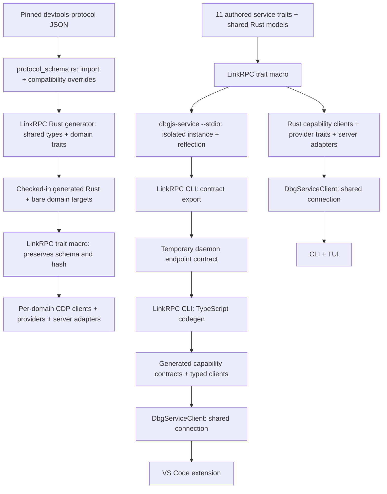

# RPC contracts and code generation

## Sources of truth

There are two independent generation paths. Do not maintain separate Rust and
TypeScript descriptions of a wire interface, or combine the browser protocol
with the daemon's API in a shared export bundle.

| Contract | Authored source of truth | Derived consumer input |
| --- | --- | --- |
| Chrome DevTools Protocol | The `devtools-protocol` version pinned in the root npm lockfile, plus explicit compatibility overrides in [`protocol_schema.rs`](../tools/cdp-codegen/src/protocol_schema.rs) | Checked-in Rust domain traits, shared types, and bare-prefix targets |
| CLI, daemon, and extension RPC | The annotated Rust traits in [`service_api/`](../src/service_api/) and shared serializable models in [`service_api.rs`](../src/service_api.rs) | Live daemon reflection, temporarily exported as an endpoint contract for TypeScript generation |

The daemon advertises its eleven capabilities and LinkRPC discovery interfaces.
It does not advertise imported CDP domain interfaces on its own RPC connection.

## Generated consumers



The Rust daemon clients and servers are generated directly from the annotated
Rust traits by LinkRPC's macro. The CLI uses those generated clients, rather than
constructing RPC method names or request objects independently.

[`scripts/generate-contracts.mjs`](../scripts/generate-contracts.mjs) orchestrates
the stdio daemon, contract export, and TypeScript CLI; it does not implement a
code generator. There is no custom daemon schema exporter or checked-in
intermediate schema bundle. The root [`build.rs`](../build.rs) only embeds Git
build provenance; it does not generate RPC contracts.

Ordinary Rust builds compile the checked-in CDP sources without importing npm
protocol JSON or running code generation. Do not edit generated sources.
The independent [`cdp-codegen`](../tools/cdp-codegen/) tool can regenerate them
even if the generated directory is missing; it does not depend on the runtime
protocol crate.
CDP providers implement supported methods of each generated domain trait.
Unsupported commands retain an explicit method-not-found
response, rather than fabricated successful results.

The extension's interface definitions and typed root bindings in
[`src/generated/`](../vscode-extension/src/generated/)
are produced by the **LinkRPC CLI**, preserving the exported wire schema and
interface identity. The extension uses its generated client and derives any
convenience aliases from generated types. Presentation models and endpoint-file
parsing are separate concerns; they must not become duplicate RPC schemas.

## Service interfaces and consumer ergonomics

Each operation has exactly one owning interface. The traits live in separate
modules, with matching implementation modules in
[`debugger_service/`](../src/debugger_service/). All implementations use the same
`DebuggerService` instance and state; this is not a split into independent
processes or databases.

| Facade field | Trait | Responsibility |
| --- | --- | --- |
| `service` | `ServiceApi` | Identity, process discovery/projection, shutdown |
| `contexts` | `ContextApi` | Contexts, connections, resource graph, observation, breakpoints |
| `sources` | `SourceApi` | Formatting, source discovery, search, mapping, export |
| `captures` | `CaptureApi` | Stored capture lifecycle and stored-result access |
| `targets` | `TargetDebuggerApi` | Resolution, attachment, execution, evaluation, values, logs/logpoints |
| `cdp` | `CdpAccessApi` | Raw CDP requests |
| `relay` | `RelayApi` | CDP relay and Playwright proxy lifecycle |
| `browser` | `BrowserAutomationApi` | Click, type, screenshot |
| `coverage` | `CoverageApi` | Live coverage lifecycle |
| `cpu` | `CpuProfilerApi` | CPU profiling |
| `heap` | `HeapProfilerApi` | Heap capture, streaming progress, selection, graph queries, comparison |

The Rust [`DbgServiceClient`](../src/service_api/client.rs) composes all eleven
generated clients over one connection:

```rust,ignore
let client = dbgjs::local_rpc::connect_existing(&state_file).await?;
let contexts = client.contexts.list_contexts(None).await?;
let sources = client.sources.list_sources(contexts[0].id.clone(), None).await?;
```

The TypeScript [`DbgServiceClient`](../vscode-extension/src/dbgServiceClient.ts)
provides the same facets:

```ts
const client = new DbgServiceClient(connection);
const contexts = await client.contexts.list_contexts({ cwd: null });
const sources = await client.sources.list_sources({
    contextId: contexts[0].id,
    path: null,
});
```

Consumers that need only one capability can use its generated client directly,
for example `ContextApiClient`; providers can implement only `ContextApi` and
register its generated server adapter. The capability catalog drives the composite
Rust facade, reflection interfaces, and daemon registration from one list.

Every interface is registered on the same authenticated connection and advertised
through LinkRPC reflection. Connecting Rust clients validate every required
interface hash, not just the lifecycle interface. The lifecycle facet retains
the original `dev.dbgjs.cdp-debugger` ID and the existing `service_info` and
`shutdown` wire methods, so the CLI can identify and stop an incompatible old
daemon before starting the new one. Its hash changes because the other methods
have moved to their capability interfaces. The default interface is lifecycle
only; clients must use the appropriate capability for other operations.

## Bare CDP interfaces versus daemon capabilities

Multiple interfaces and bare wire addressing are separate concerns. Each CDP
domain has an interface with local members (for example `evaluate`) and a bare
root target containing its wire prefix (`Runtime.`). The target bundles the
interface and addressing information so consumers do not reconstruct prefixes.
The resulting request is still `Runtime.evaluate`, including when sent through
the existing flat-session multiplexer. Cross-domain components share Rust type
identity rather than independently generated lookalike structs.

The daemon uses qualified addressing for its capability interfaces; it needs no
bare bindings.

## Resource references

Methods operating on one connection accept `ConnectionRef { context_id,
connection_id }`. Methods operating on one target accept `TargetRef {
connection: ConnectionRef, target_id }`. Both serialize with camel-case fields.
Context-only operations and optional filters remain separate.

These references identify resources, not their freshness. Generation, pause
epoch, expected revision, and force arguments retain their existing validation
semantics and are not hidden inside identity objects.

## Stdio transport

`dbgjs-service --stdio` hosts the same reflected capabilities over raw NDJSON
stdin/stdout. It is an isolated, ephemeral instance: it never reads or writes
the default daemon endpoint or persistent contexts, and cannot be combined with
`--ensure` or `--state-file`. EOF or the shutdown RPC closes its runtimes and
removes its temporary state. Diagnostics go to stderr, not the protocol stream.

Inherited stdio is a trusted transport and has no socket authentication
preamble. The persistent daemon's Unix socket / Windows named-pipe transport
continues to require its existing authentication preamble.

## Regeneration and drift checks

From the repository root:

```sh
npm run generate:contracts
npm run check:contracts
```

These commands build an isolated stdio daemon, export its reflected contracts
and endpoint bindings into a temporary document, then invoke `linkrpc codegen` to generate
TypeScript. The check compares exact output without overwriting stale files.
Commit generated TypeScript together with its authored source changes.

The TypeScript generation step is the installed CLI, not a second generator
inside dbgjs. The orchestrator exports one endpoint contract and generates its
interfaces and bindings together:

```sh
npx --no-install linkrpc --context :empty --no-use-env \
  --endpoint 'cmd-stdio:?argv=/absolute/path/to/dbgjs-service&argv=--stdio' \
  contract export --output /tmp/daemon.json
npx --no-install linkrpc codegen \
  --input /tmp/daemon.json \
  --names /tmp/names.json \
  --output vscode-extension/src/generated/interfaces.ts
```

Use the root `check:contracts` command to check the complete generated set,
including generated-file headers, missing files, and obsolete modules.
The naming document maps exact interface identities to names such as
`ContextApi`, and root bindings to names such as `ContextApiRoot`.
`DbgServiceClient` passes those generated bindings to `connection.get`, rather
than reconstructing their addresses. Shared component schemas come from the
same authored Rust models, not separately maintained TypeScript definitions.

When changing daemon RPC, edit the owning Rust trait/shared models first. When changing CDP
support, update the pinned upstream protocol or an explicit compatibility
override first. Regenerate, then compile and test the consumers; do not repair a
type error by manually editing generated files or weakening a wire type.

CDP generation is independent:

```sh
npm run generate:cdp
npm run check:cdp
```

Both generated Rust and TypeScript are checked in, carry generated-file headers,
and are marked generated for GitHub. CI runs both drift checks; ordinary builds
do not silently update either set.

The endpoint contract contains interface schemas and optional named/root service
bindings, a default interface, and bare interfaces with exact wire prefixes.
Interface definitions are generated once; typed bindings reuse them. A diagnostic
`ls --dump` is a different artifact: it contains discovery topology, progress,
and failures, and is not the input to code generation.

## Registry dependencies and local LinkRPC development

Ordinary installs and CI resolve LinkRPC from the public npm and Cargo
registries. The checked-in manifests and lockfiles must contain only registry
dependencies; CI does not check out a sibling repository, use relative
`file:`/`path` links, or vendor LinkRPC sources. Required LinkRPC releases must
be published before their versions are selected in this repository.

The locked LinkRPC versions provide shared component generation, typed endpoint
bindings, schema-preserving macro-backed CDP clients, and heap-progress streams.
The Rust generator emits a trait annotated with
`#[link_rpc_interface(schema_json = "...")]`; the same macro used by the daemon
trait generates the CDP client and provider infrastructure. The imported CDP
schema and hash are preserved rather than re-derived from generated Rust types.
The TypeScript runtime and CLI dependencies are pinned together.
Rust trait models use the same schemars 0.8 version as LinkRPC's shared-schema
collector; schemars 1 derives implement a different `JsonSchema` trait.

For opt-in development across both repositories, a developer may use a local
sibling checkout by temporarily overriding the relevant npm and Cargo
dependencies in their working tree. Build any required LinkRPC package outputs
in that checkout before installing this repository. Keep those local manifest
overrides and any resulting lockfile changes uncommitted and out of staging,
then restore the registry manifests and lockfiles before running the ordinary
install and contract drift check. Never commit local `file:`/`path` links or
copy package sources or tarballs into this repository.

To validate an explicitly built CLI without changing existing npm links, pass
`npm run generate:contracts -- --cli /absolute/path/to/linkrpc.js` (or the same
option to `check:contracts`). CI always uses the pinned installed CLI.

For the isolated sibling development layout, an **uncommitted**
`.cargo/config.toml` can contain:

```toml
[patch.crates-io]
linkrpc = { path = "../linkrpc/rust/crates/linkrpc" }
linkrpc-macros = { path = "../linkrpc/rust/crates/linkrpc-macros" }
linkrpc-tokio = { path = "../linkrpc/rust/crates/linkrpc-tokio" }
```

Resolve the local patch once without `--locked`, then run the locked build,
generation, and tests. Remove this config and restore the registry lockfile
before committing. Ordinary builds, contract generation, and CI use only the
published registry dependencies.

## Typed heap-progress streams

`capture_heap_snapshot` and `take_heap_snapshot` declare
`#[output_stream(HeapSnapshotProgress)]` on the Rust trait. The annotation
describes the method's output: it exports `serverStream`, generates a
provider-side `StreamSender<HeapSnapshotProgress>`, and gives Rust and TypeScript
clients typed progress on the capture call alongside its final result.
The CLI consumes this stream rather than issuing 100 ms snapshot polls.

Progress comes from the existing CDP capture watch and is scoped to the actual
capture operation. The final progress update precedes the RPC response; the
underlying CDP snapshot chunks still finish writing before success is reported.
`get_heap_snapshot_progress` remains an independent last-known snapshot query,
not the transport for capture progress.

Cancellation is advisory: CDP has no interoperable heap-capture cancellation
command. A cancelled or disconnected LinkRPC caller must not interrupt raw CDP
chunk ingestion or leave a writer or capture reservation behind. The active CDP
operation is drained safely; the cancelled LinkRPC call reports cancellation.
Cancelled named captures are cleaned up before their reservation is released.
Subsequent captures can then run with their own progress. Cancellation is not
transaction rollback: `take_heap_snapshot` can have already atomically replaced
the requested destination file, which is retained after cancellation.

The generated TypeScript integration test starts the real Rust daemon and a
Node inspector, exercises completion/cancellation/disconnect/recovery, and runs
both CLI heap capture and snapshot commands:

```sh
cargo build --locked --bin dbgjs --bin dbgjs-service
npm --prefix vscode-extension ci
npm --prefix vscode-extension run test:heap-streaming
npm run check:contracts
```

## Type-safety boundaries

Known RPC methods, parameters, results, and notifications come from the shared
contracts. Raw CDP proxying, arbitrary evaluated JavaScript values, and
protocol-defined open JSON payloads remain explicit dynamic boundaries. Such
payloads are not evidence that another handwritten wire schema is needed.

Heap snapshot ordering, raw-event forwarding, older protocol compatibility, and
daemon authentication remain runtime behavior and are covered by their tests;
generation must not silently change them.
