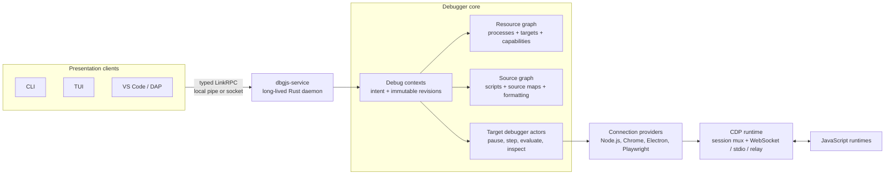
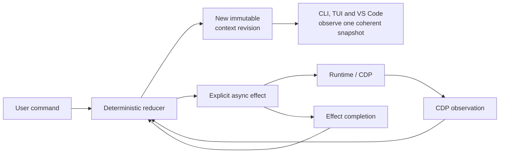

# dbgjs (cdp-client): Architecture in 60 Seconds

> **dbgjs is a native, service-oriented JavaScript debugger that turns volatile
> CDP sessions into durable, coherent debugging state.**

## System architecture

## State and event flow

## Three points to remember

1. **One daemon, many clients:** UIs are projections over the same authoritative
   service state; they do not open independent CDP connections.
2. **One context, many runtimes:** durable intent such as breakpoints can span a
   Node.js backend and browser frontend, and survives disconnects.
3. **CDP is an implementation detail:** reducers, immutable revisions, resource
   capabilities, and the shared source graph provide stable semantics above CDP.

## 1-minute talk track

dbgjs is built around one long-lived Rust service rather than putting debugger
logic into every UI. The CLI, terminal UI, and VS Code adapter all use the same
typed LinkRPC API, so they see one authoritative state. Inside the service, a
debug context stores durable intent such as breakpoints and can coordinate
multiple connections—for example, Node.js and Chrome. Connection providers
discover processes and targets, while target debugger actors translate stable
debug operations into CDP over WebSocket, stdio, or relays. Runtime events,
commands, and asynchronous results all pass through deterministic reducers,
producing immutable revisions that clients can observe consistently. Resource
and source graphs then unify target capabilities, scripts, source maps, and
formatted sources. In short: CDP supplies runtime facts; dbgjs supplies the
durable debugger model.

Further detail: [Debugger Data Model: Short Overview](./debugger-data-model-overview.md).
